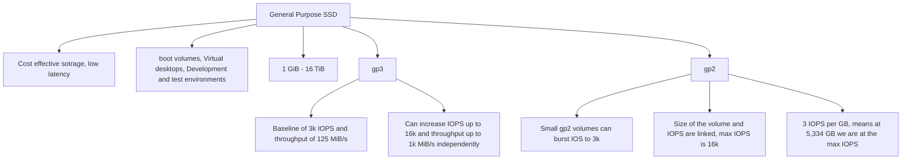
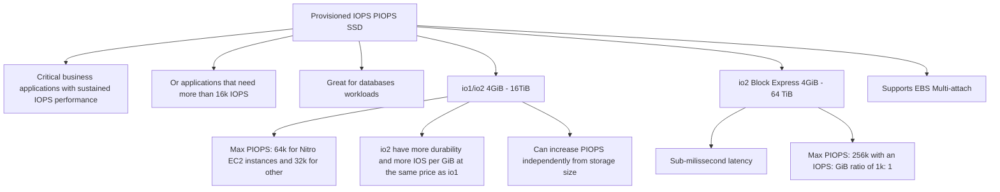
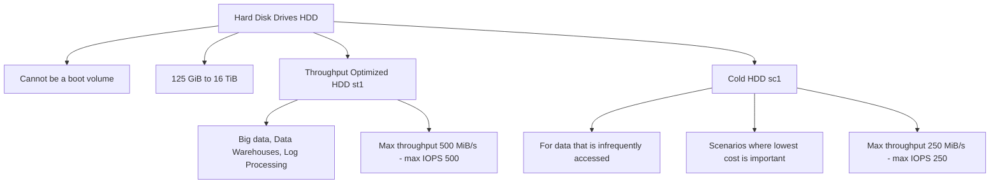

# EBS Overview

* EBS = Elastic Block Store
* Anexa as instâncias enquanto executadas
* Persistem os dados mesmo depois que a intância seja encerrada
* Só podem ser montados em uma instância por vez
* É atrelado a uma Zona de Disponibilidade especifica
* Um exemplo simples é pensar que o EBS é um USB em que podemos conectar em diversos computadores e permanecer com os mesmo dados.
* 30 Gb de armazenamento grátis de "General Purpose"(SSD)
* Ele é fixo a uma zona de disponibilidade, ou seja, se está na us-east-1a ele não pode ser "conectado" na us-east-1b
* Precisamos informar com antecedencia quantos GB iremos usar mas poderar aumentar com o decorrer do tempo caso tenha necessidade
* O mesmo EBS não pode estar em duas instancias, mas uma instancia pode ter dois EBS

# EBS Snapshots

* Backup of EBS volume at a point in time
* Não é necessário separar o volume do backup, mas é recomendado
* Podemos criar cópias das snapshots entre regiões ou Zonas de Disponiblidade
* Por exemplo: 
![[Pasted image 20230429161903.png]]
* EBS Snapshot Archive move a snapshot to an "archive tier" that is 75% cheaper and Takes within 24 to 72 hours for restoring the archive it's not immediate
* Recycle Bin for EBS Snapshots is responsable to retain deleted snapshots so you can recover them after an accidental deletion and you can set a specify retention (from 1 day to 1 year)
* Fast Snapshot Restore (FSR) is responsible to force full initialization of snapshot to have no latency on the first use, is very expensive, is important if your snapshot is big and need inicialize an EBS or instance very quickly

# AMI Overview

* AMI = Amazon Machine Image
* AMI are a customization of an EC2 instance
* Nós adicionamos nossa própria configuração de software, OS, monitoramento, dentre outras coisas. Com isso a Iniciação da instancia fica mais rapida pois tudo o que configuramos já foi pré instalado
* Construido para uma região especifica e podemos criar cópias entre regiões)
| Titulo 1 | Titulo 2 |
| -------- | -------- |
| Public AMI         | AWS Provide          |
| Your own AMI         | you make and maintain them yourself          |
| AWS Marketplace AMI        | AMI someone else made          |

* ![[Pasted image 20230429164356.png]]

# EC2 Instance Store

* Usamos o EC2 Instance Store para um hardware de alta performance
* Better I/O performance (I/O, input/output,  são módulos que têm a função de organizar e controlar o fluxo de dados produzidos pelas máquinas no chão de fábrica)
* Se pararmos o EC2 Instance Store nós perdemos tudo que estava guardado dentro dele (ephemeral storage)
* Good for buffer/cache/scratch data/temporary content
* Risco de perda de dados se o hardware falhar
* Nossa responsabilidade, então é fazer Backups e Replicas

# EBS Volume Types

* gp2/gp3 (SSD) -> General purpose SSD volume tat balances price and performance for a wide variety of workloads (workloads -> cargas de trabalho)
* io 1/ io 2 (SSD) -> Highest-performance SSD volume for mission-critical low-latency or high-throughput (throughput -> taxa de transferencia)
* st 1 (HDD) -> Low cost HDD volume designed for frequently accessed, throughput-intensive workloads
* sc 1 (HDD) -> Lowes cost HDD volume designed for less freqeuntly accessed workloads
* EBS Volumes são caracterizados por Size | Throughput | IOPS (I/O operations per second)
* Apenas o gp2/gp3 e io1/io2 podem ser usados para bootar instancias EC2

* O importante é lembra que se queremos mais de 32k IOPS nós precismos de EC2 Nitro com io1 ou io2

# EBS Multi-Attach - io1/io2 family

* Anexa o mesmo EBS volume para multiplas intancias de EC2 na mesma zona de Disponibilidade
![[Pasted image 20230429172913.png]]

* Só funciona para io/1 ou io/2 EBS volumes
* Each instance has full read and write permissions to the high-performance volume
* Use case:
	* Achieve hifher application availability in clustered Linux applications (ex.: Teradata)
	* Applications must manage concurrent write operations
* Up to 16 EC2 Instances at a time
* Must use a file system that's cluster-aware (not XFS, EXT4, etc...)

# Amazon EFS - Elastic File System

* Managed NFS (network file system) that can be mounted on many EC2
* EFS works with EC2 instances in multi AZ
* Highly available, scalable, expensive (3x gp2), pay per use
* Use cases:
	* content management
	* web serving
	* data sharing
	* Wordpress
* Uses NFSv4.1 protocol
* Uses security group to control access to EFS
* Compatible with Linux bases AMI (not Windows)
* Encryption at rest using KMS
* POSIX file system that has a standart file API
* Não precisamos informar qual o tamanho, ele se auto-escala e pagamos pelo uso
* EFS Scale:
	* 1k of concurrent NFS clients, 10 GB+/s throughput
	* Grow to petabyte-scale network file system, automatically
* Performance Mode (set at EFS creation time)
	* General Purpose (default) - latency-sensitive use cases (web server, CMS, etc...)
	* Max I/O - higher latency, throughput, highly prallel (big data, media processing)
* Throughput Mode
	* Bursting - 1 TB = 50 MiB/s + burst of up to 100MiB/s
	* Provisioned - set your throughput regardless of storage size, ex: 1 GiB/s for 1 TB storage
	* Elastic - automatically scales throughput up or down based on your workloads
		* Up to 3Gib/s for reads and 1GiB/s for writes
		* Used for unpredictable workloads
* Storage Tiers (lifecycle management feature - mode file after N days)
	* Standard: for frequently accessed files
	* Infrequent access (EFS-IA): cost to retrieve files, lower price to store. Enable EFS-IA with a Lifecycle Policy
* Availibility and durability
	* Standard: Multi-AZ, great for prod
	* One Zone: One AZ, great for dev, backup enabled by default, compatible with IA (EFS One Zone-IA)
* Over 90% in cost savings

# EBS vs EFS

* EBS:
	* EBS Volumes:
		* one instance(ecept multi-attach io1/io2)
		* are locked at the AZ level
		* gp2: IO increases if the disk size increases
		* io1: can increase IO independently
	* To migrate an EBS volume across AZ
		* Take a snapshot
		* Restore the snaptshot to another AZ
		* EBS backups use IO and you shouldn't run them while your application is handling a lot of traffic
	* Root EBS Volumes of instance get terminated by default in the EC2 instance gets terminated (we can disable that)

* EFS:
	* Mounting 100s of instances across AZ
	* EFS share website files (wordpress)
	* Only for Linux Instances (POSIX)
	* EFS has a higher price point than EBS
	* Can leverage EFS-IA for cost savings