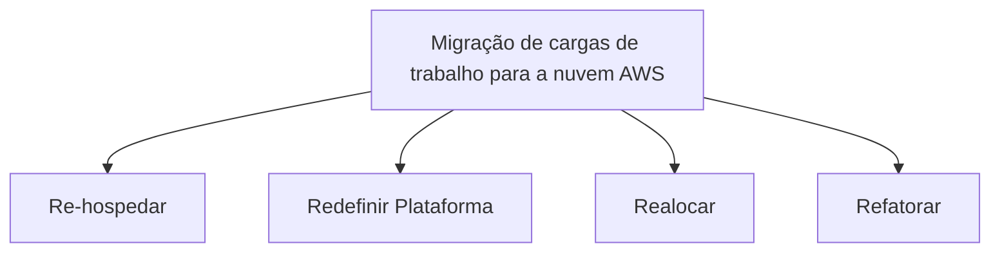

# Os sete Rs
## Re-hospedar
## Redefinir Plataforma
## Realocar
## Refatorar
## Retirar
## Reter
## Recomprar

# Re-hospedar: lift and shift
![[Pasted image 20230109150010.png]]

## Recriação da rede on-premises, hospedada somente na AWS
## Automatização com ferramentas como AWS Application Migration Service
## Mais fácial otimizar e reprojetar aplicativos após a migração

# Realocar: lift and shift no nível do Hypervisor
![[Pasted image 20230109150357.png]]
## Migração específica para VMware Cloud on AWS
## Exemplo
### Migrar o banco de dados Oracle do host do Hypervisor para o VMware Cloud on AWS

# Redefinir a plataforma: lift, tinker and shift
![[Pasted image 20230109150541.png]]

## Retenção da arquitetura principal
## Como fazer otimizações direcionadas para a nuvem AWS
## Exemplos:
### Migração de bancos de dados para o Amazon RDS
### Migração de aplicativos para o Amazon Elastic Beanstalk

# Refatorar: modernizar
![[Pasted image 20230109151617.png]]
## Reimaginar como o aplicativo é arquitetado e desenvolvido
## Uso de recursos nativos da nuvem

# Outras Estratégias
## Retirar
### Desativação de aplicativos inúteis que reduzem a velocidade, o gerenciamento e a segurança
## Reter/Revisitar
### Manter determinados aplicativos on-premises
## Recomprar
### Mover fluxos de trabalho para software como serviço (SaaS)

# Estratégia de migração da Maria
## Redefinição de plataforma
## Migrar funcionalidade
## Otimizar Componentes
