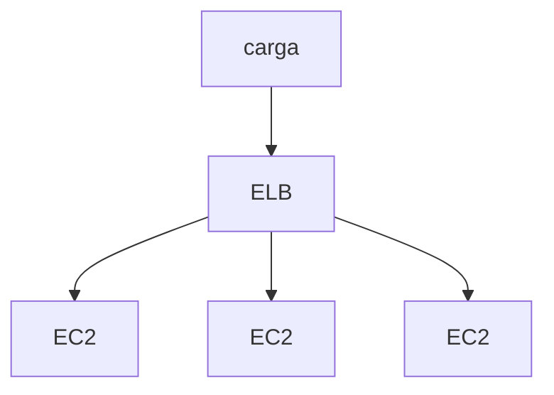

# Serviços computacionais
## Amazon EC2 (Capacidade Computacional Redimensionável)
### Elasticidade, Controle, Flexibilidade (Podem escolher tipos de instancias e SOs), Integrado (Variedade de Aplicativos), Confiável, Seguro, Econômico, Fácil.
### Ampla seleção de configurações de Hardware e Software otimazidos para qualquer tipo de cliente.

## Amazon EC2 Auto Scalig (Aumente ou reduza numero de instâncias)
### Novas instâncias antes dos períodos de pico;
### Monitoramento para aumentar a quantidade de forma programática;
### Dimensionamento automático;
### Paga somente pelos recursos necessários e quando necessário (Exemplo da Loja no Natal);
### Nós decidimos onde o EC2 Auto Scaling implantará recursos;
### Especificamos a Amazon [VPC](Redes.md) e sub-redes(No minimo duas redes em diferentes zonas de disponibilidade).

## Elastic Load Balancing (Distribua o Tráfego de entrada)
### Distribui automaticamento o tráfego entre várias instâncias do EC2;

### Aumenta a disponibilidade e a tolerância a falhas;
### Configurar Health Checks;
### Descarregamento de criptografia e descriptografia.

## Amazon Elastic Container Service (Execute aplicativos em um cluster gerenciado)

## Amazon Elastic Kubernets Service (Execute aplicativos Kubernets na AWS e no local)

## AWS Lambda (Execute o código em resposta a eventos)

# Resumo
#### Instâncias do EC2 = componentes básicos;
#### Aplicar AMIs para personalizar a instalação do software quando iniciado;
#### Configurar o auto scalling e o ELB para que os apps estejam sempre executando a quantidade exata de instãncias;
#### Pagar apenas pelo o que é usado
