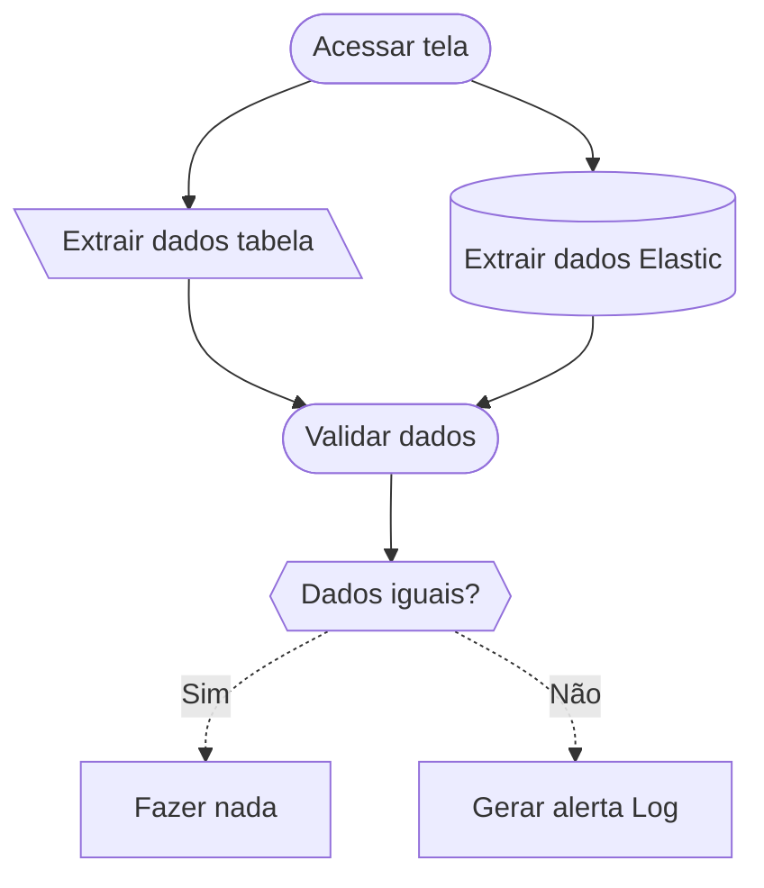
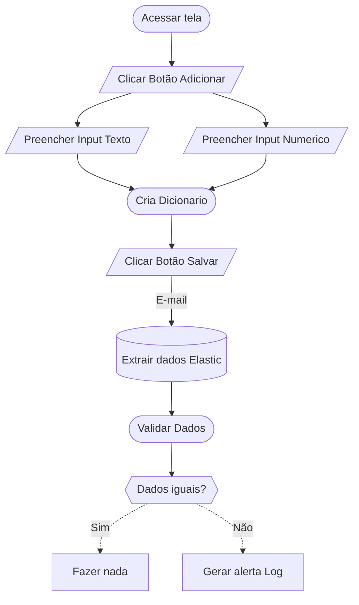
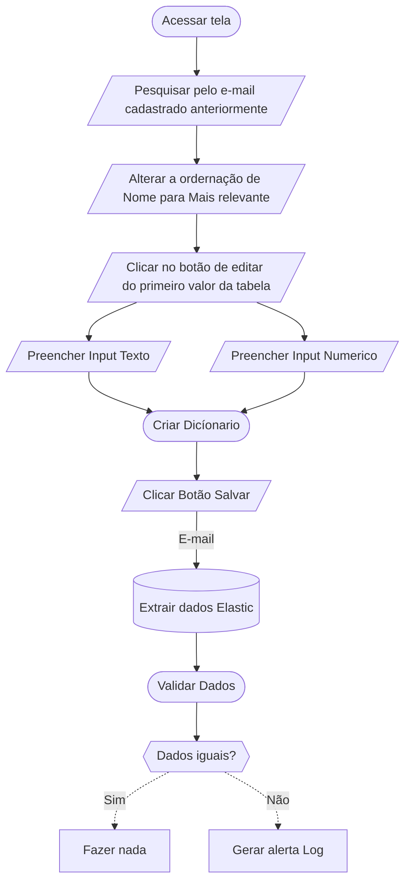
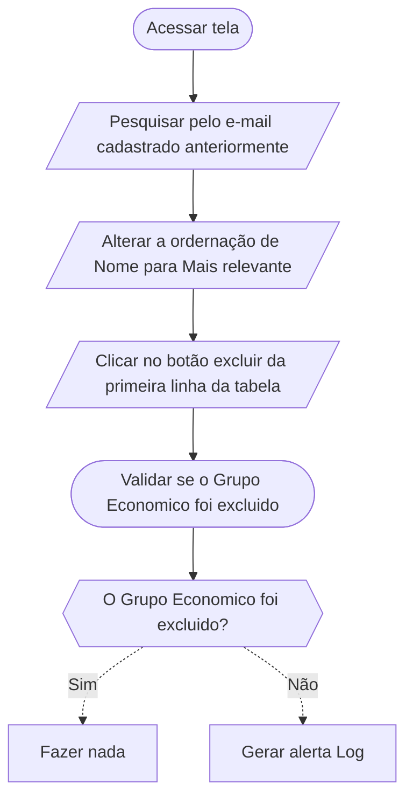

# Validar Tabela

## Extração Dados Elastic
* Fazer consulta com "s_record_status": "ACTIVE"
```python
query = self.server.build_query(size=100)
```

# Validar Cadastro

## Extração Dados Elastic
* Fazer consulta com "s_record_status": "ACTIVE" e "admin_email": email_cadastrado
```python
query = self.server.build_query(admin_email=email_cadastrado,size=100)
```
# Validar Edição


# Validar Exclusão

## Validação Dados Elastic
* Fazer consulta com "s_record_status": "DELETED" e com ordenação do "s_record_creation_date" por ordem decrescente(Do mais novo para o mais velho).
```python
query = self.server.build_query(size=1, s_record_status="DELETED", sort="s_record_creation_date": "desc")
query['query']['bool']['must'].pop(0)
```
