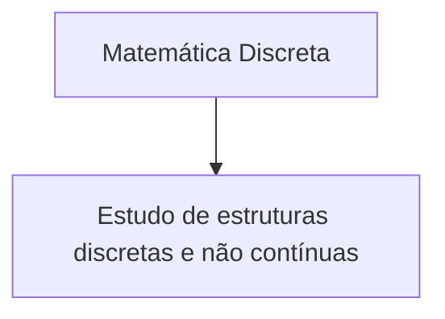

![[Pasted image 20230224184826.png]]

Problema de parada não tem solução
![[Pasted image 20230224190228.png]]
N = {0, 1, 2, 3, ...}
Z = {..., -3, -2, -1, 0, 1, 2, 3, ...}
Q (Divisão de dois inteiros) = {A/B e BEZ com b != 0} ou {A/B e BEZ*}
I (Numeros que não surgem da divisão de dois inteiros) = {**√**3, **√**2, **√**5, **π**,  **e**} 
R (Conjunto dos Nºs reais) = Q**U**I
C (Conjunto dos Nºs complexos ) = z = a (parte real do numero complexo) + bi Parte imaginaria do numero complexo

| Símbolo | Descrição                                                                     | Exemplo                                 |
| ------- | ----------------------------------------------------------------------------- | --------------------------------------- |
| N       | Conjunto dos Naturais                                                         | {0, 1, 2, 3, ...}                       |
| Z       | Conjunto dos Inteiros                                                         | {..., -3, -2, -1, 0, 1, 2, 3, ...}      |
| Q       | Conjunto dos Racionais (Divisão de dois inteiros)                             | {A/B e BEZ com b != 0} ou {A/B e BEZ*}  |
| I       | Conjunto dos Irracionais (Números que NÃO surgem da divisão de dois inteiros) | {**√**3, **√**2, **√**5, **π**,  **e**} |
| R       | Conjunto dos Reais                                                            | Q**U**I                                 |
| C       | Conjunto dos Complexos                                                        | z = a + bi                              |

Lembrar de colocar o risquinho nas letras

